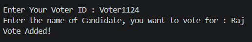
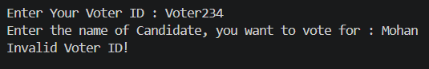

# Voting-Blockchain
## This is a submission to a task, which includes understanding and creating a Blockchain for the application of Voting. Using this, we will record votes transparently, securely and in tamper-evident way.

Language used to complete this task is C++.
The Problem Statement had demanded to build a simple blockchain-based voting system from scratch which should include :
- Block Structure
- Blockchain Class
- Voter and Candidate Management
- Vote Counting
- Tampering Detection
- Contract like Voting Rules
- Election Result Declaration
- Simple User Interface

### Features

1. #### Registered Voter Verification
    <details>
    <br>
    The Voters are actually already registered hardcoded in a vector "reg_voter_id_list". This function checks if the input voter id is stored in "reg_voter_id_list" or not. If yes, then it returns true as it can be added in the block.
    <br><br>
        
    ```
    // To check if the voter id in input is registered or not.
    bool valid_reg_voter_id(string votrid)
    {
        for(int i = 0; i < reg_voter_id_list.size(); i++)
        {   
            if (votrid == reg_voter_id_list[i])
            {
                return true;
            }
        }
        cout << "Invalid Voter ID!\n";
        return false;
    }
    ```

     <br>
    
    
    </details>

2. #### Registered Candidate Verification
    <details>
    <br>
    The Candidates are actually already registered hardcoded in a vector "reg_candidates_list". This function checks if the input Candidate Name is stored in "reg_candidates_list" or not. If yes, then it returns true as it can be added in the block.
    <br><br>
        
    ```
    // To check if the Cadidate Name in input is registered or not.
    bool valid_candidate(string candt)
    {
        for(int i = 0; i < reg_candidates_list.size(); i++)
        {
            if (candt == reg_candidates_list[i])
            {
                return true;
            }
        }
        cout << "Candidate Chosen by you is not registered!\n";
        return false;
    }
    ```

     <br>
    
    
    </details>
    
3. #### Voting Rules Contract

    <details>
    <br>
    A Contract which we will use while adding new vote.<br>
    It checks <br>
    - Is Input Voter ID is registered? <br>
    - Is the Candidate, which is voted, registered? <br>
    - Has this voter already voted? - Checking duplicate Votes - No means True and Yes means False. <br>
        
    ```
    bool Voting_Rules_Contract(vector<block>& voteblock, string voterid, string candidate)
    {
        if (valid_reg_voter_id(voterid) && valid_candidate(candidate)) // Checks 1. and 2.
        {
            // Its yes to 1. and 2., then proceeds for Duplicate Voting Check.
    
            // If it's the first vote, then of course there is no duplicate, so return true.
            if(voteblock.size()==1)
            {
                return true;
            }
    
            // if its not the index 1 block, i.e if it is not the first block after genesis.
            bool is_duplicate = false;
            for(int i = 1; i < voteblock.size(); i++)
            {
                // Run a loop in existing blockchain.
                if (voteblock[i].get_vote_data().get_voter_id_00() == voterid)
                {
                    // Check if new vote's voterid is already in blockchain, if yes, then its a duplicate, he/she is voting again.
                    is_duplicate = true;
                    break; // If we find duplicate even once, we don't go further as there's no need. We already got the theif(Just for the example, hehe).
                }
            }
    
            if(!is_duplicate)
            {
                // If there is no duplicate, then return true.
                return true;
            }
            else
            {
                // If there's a duplicate, return false and don't count the vote.
                cout << "You have already voted! We will not count this vote.\n";
                return false;
            }
        }
        else
        {
            // If it doesn't satisfy any of the 1. and 2. conditions.
            return false;
        }
    }
    ```

     <br>
    
    
    </details>
    
4. #### Blockchain Based Vote Storage

    <details>
    <br>
    To create a Blockchain, we have created a class Blockchain and added a member "vector<block> voteblockchain". This is a collection of "class block". Each Block contain data about vote, like index, voting data(voter id and voted candidate), previous hash, current hash, and timestamp. In Blockchain Class, we have add_vote(), create_genesis() and is_valid() functions.
        - add_vote() : takes parameters like voter id and candidate and get is checked through Voter Contract, and if it satisfies, it adds a new block to blockchain.
        - create_genesis() : In blockchain, we need to create a fake block at first position(zeroth index). This funciton calls add_vote() and add a block with fake data in it.
        - is_valid() : This function checks tampering.
    <br><br>
        
    ```
    class blockchain
    {
        private :
        vector<block> voteblockchain;
        int indexforuse;
        public :
    
        // To add new vote/block to blockchain.
        void add_vote(string voter_id, string candidate)
        {
            if (indexforuse != 0) // When it's not genesis block.
            {
                if(Voting_Rules_Contract(voteblockchain, voter_id, candidate))
                {
                    // Here voter_id and candidate name, come from user.
                    voting_data vdata{voter_id, candidate};
                    block bl{indexforuse++, vdata, voteblockchain.back().get_currentHash()}; // The third parameter is previous hash. We assign "current_hash" of previous block to "previous_hash" of current/new block.
                    voteblockchain.push_back(bl);
                }
            }
            else // For Genesis
            {
                // Here, voter_id and candidate name is provided by create_genesis_block().
                voting_data vdata{voter_id, candidate};
                block bl{indexforuse++, vdata, "0"}; // Here, previous_hash is provided as zero. Why? Just for fun, we can assign anything to it.
                voteblockchain.push_back(bl);
            }
        }
    
        // To Create Genesis Block.
        void create_genesis_block()
        {
            if(voteblockchain.size() != 0)
            {
                // If there is already a block present in blockchain, then we don't need another genesis.
                return;
            }
            else
            {
                // When there is no block present in blockchain, create genesis.
                indexforuse = 0;
                add_vote("Zeroth_User", "No vote");
            }
        }
    
        // Getters.
        block& get_block_at_idx(int idx)
        {
            return voteblockchain[idx];
        }
        int get_blockchainsize()
        {
            return voteblockchain.size();
        }
    
        // IsValid Function - Used for Tampering Detection
        bool isvalid()
        {   
            
            for(int i = 1; i < voteblockchain.size(); i++)
            {
                if(voteblockchain[i].get_currentHash() != voteblockchain[i].calculatehash() || voteblockchain[i].get_previousHash() != voteblockchain[i-1].get_currentHash() )
                {
                    /* Two conditions checked
                        1. Calculate the current hash of block and see if it is actually equal to current_hash of that block. If not, then the data is changed.
                        2. If previousHash is equal to currentHash, then no new block is added in the middle of blockchain.
                    */
                    return false;
                }
                else
                {
                    for(int j = 1; j < voteblockchain.size(); j ++)
                    {
                        if ( j != i && voteblockchain[i].get_vote_data().get_voter_id_00() == voteblockchain[j].get_vote_data().get_voter_id_00())
                        {
                            // Checking if the voter has already voted.
                            return false;
                        }
                    }
                    
                }
                
            }
            return true;
        }
    };
    ```

     <br>
    
    
    </details>
    
5. #### Calculating Current Hash Using SHA256

    <details>
    <br>
    To use SHA256, I had installed files, i.e, sha256.h and sha256.c. This is the only feature, where I had used a bit of AI asking it to generate "generate_sha256()" function which uses these 2 files and generate Hash. In "calculatehash()" function, we call "generate_sha256()" to create   
    <br><br>
        
    ```
    string calculatehash()
    {
        string input = (to_string(index) + timestamp + vote_data.get_voter_id_00() + vote_data.get_vote_to_candidate_00() + previousHash);
        return generate_sha256(input);
        
    }
    ```

     <br>
    
    
    </details>
    
6. #### Block Linking Through Previous Hash

7. #### Genesis Block Creation

8. #### Tamper Detection

9. #### Vote Counting

10. #### Winner Declaration


### Required Files
- **Voting_Blockchain.cpp** : Our main file, it includes the complete project.
- **sha256.h**
- **sha256.c** <br>These two sha256 files are used to create a function that generates hash from string.

#### How to Compile and Run

Type this command in the terminal : 
```
    // First type this command.
    g++ Voting_Blockchain.cpp sha256.cpp -o Voting_Blockchain.exe

    // Clik enter and after debugging, type this command.
    .\Voting_Blockchain.exe
```

#### Known Limitations
- Candidate List and Voter List are Hardcoded.
- The Winner Declaration Algorithm will only work for 3 Candidates, for more we would need to refine complete function.
- When a new voter add his vote, he can see previous votes which are not cleared from the screan. I have although commented a solution to clear the compiler using system("cls"). But still a voter can view the Blockchain and see, who has voted whom.
- As anyone can see who has voted whom using View Blockchain option, we can actually convert voterid into a hash using sha256 and then store it at voter_id_00.

#### Author
Harish Lunge<br>First Year,<br>Ocean Engineering and Naval Architechture,<br>IIT Kharagpur

### Thank You!
